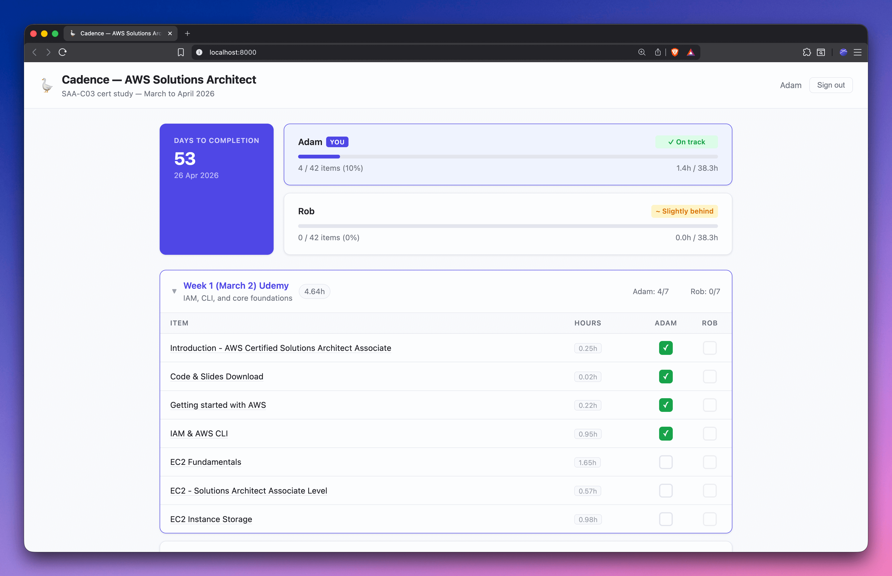
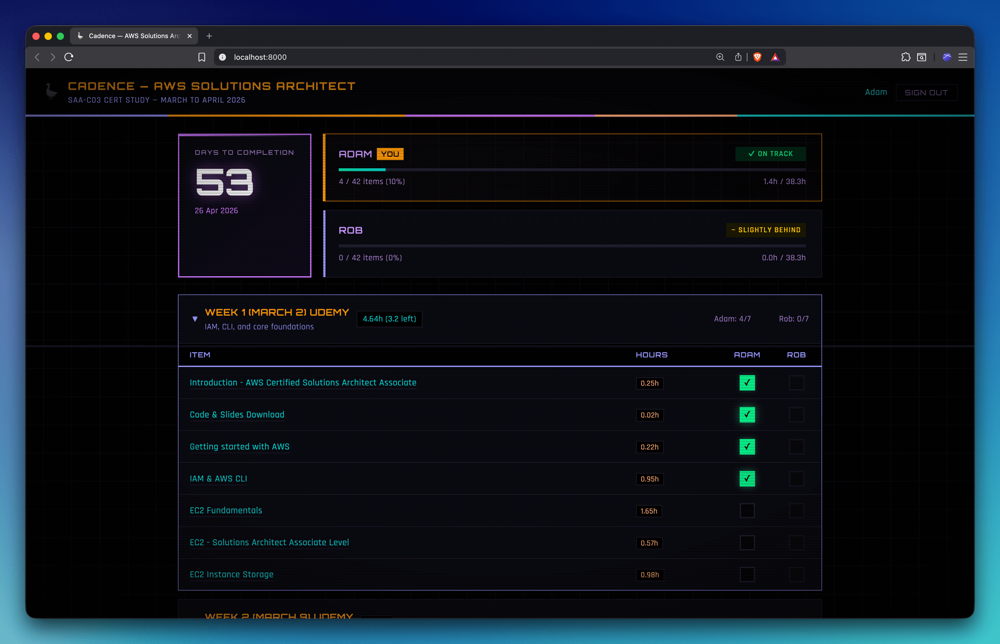
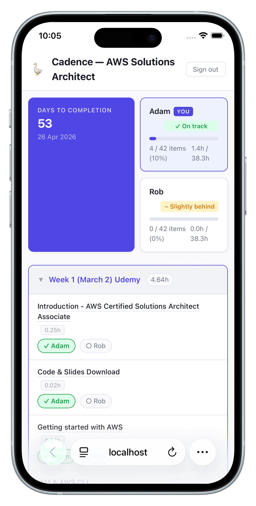
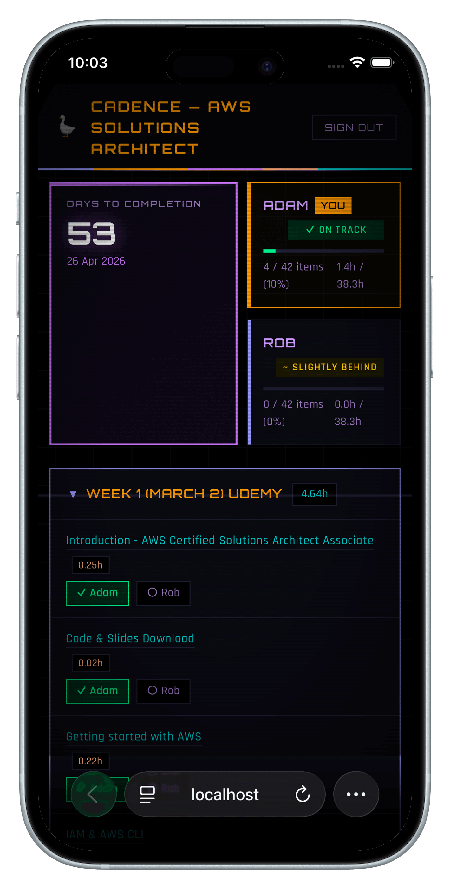

# Cadence 🪿

**A few hours a week, compounding. At a goose's pace.**

A reusable, self-hosted progress tracker for working through any structured goal with friends or colleagues. Drop in a CSV of items, configure your users and timeline, deploy to AWS, and get a shared dashboard with per-user checkboxes, progress tracking, and a countdown to completion.

Runs on AWS free tier.

## Use cases

- Certification study groups (AWS, CKA, CISSP, etc.)
- Monthly reading lists
- 30-day coding challenges
- Quarterly OKRs
- Any N-period goal with M collaborators

## Features

- **Any interval** — week, month, day, year, sprint, quarter
- **N users** — defined in config, each with their own login
- **Per-user checkboxes** — you can only check your own; others are read-only
- **Progress bars** — items completed + hours completed per user
- **Countdown** — days remaining to completion date
- **Persistent state** — stored in DynamoDB, survives page refreshes
- **Auth** — AWS Cognito email/password login
- **Static frontend** — no server, just S3 + CloudFront
- **Themes** — clean default or dark sci-fi LCARS theme, with a ☀️/🌙 toggle per user
- **Local dev mode** — iterate on the UI without deploying
- **Validate script** — verify all AWS resources are healthy

## Screenshots

<table>
<tr>
<th>Default theme</th>
<th>LCARS theme</th>
</tr>
<tr>
<td></td>
<td></td>
</tr>
<tr>
<td></td>
<td></td>
</tr>
</table>

## Architecture

```
┌─────────────────────────────────────────────────────────┐
│  Browser                                                │
│  index.html + app.js + style.css + cadence.json         │
└──────────────────────┬───────────────┬──────────────────┘
                       │               │
                 static assets     API calls
                       │          (JWT in header)
                       ▼               ▼
               ┌──────────────┐  ┌──────────────┐
               │  CloudFront  │  │ API Gateway  │
               │  (HTTPS CDN) │  │ (HTTP API)   │
               └──────┬───────┘  └──────┬───────┘
                      │                 │
                      │          ┌──────┴───────┐
                      │          │   Cognito    │
                      │          │   JWT Auth   │
                      │          └──────┬───────┘
                      ▼                 ▼
               ┌──────────────┐  ┌──────────────┐
               │   S3 Bucket  │  │    Lambda    │
               │  (frontend)  │  │  (API logic) │
               └──────────────┘  └──────┬───────┘
                                        │
                                        ▼
                                 ┌──────────────┐
                                 │   DynamoDB   │
                                 │ (user state) │
                                 └──────────────┘
```

**Data flow:**

* The frontend is a static SPA served from S3 via CloudFront.
* On login, Cognito issues a JWT.
* Every API call includes the JWT in the `Authorization` header.
* API Gateway validates it against the Cognito User Pool before the request reaches Lambda.
* Lambda reads/writes checkbox state in DynamoDB, keyed by the user's email extracted from the JWT claims.

---

## Prerequisites

Before you start, you need:

| Requirement        | Notes                                                                                                                            |
| ------------------ | -------------------------------------------------------------------------------------------------------------------------------- |
| **AWS account**    | [Create one free](https://aws.amazon.com/free/)                                                                                  |
| **AWS CLI v2**     | [Install guide](https://docs.aws.amazon.com/cli/latest/userguide/install-cliv2.html) — run `aws configure` to set up credentials |
| **Python 3.11+**   | `python3 --version` to check                                                                                                     |
| **Linux or macOS** | Windows users: use [WSL2](https://learn.microsoft.com/en-us/windows/wsl/install)                                                 |

Your AWS credentials need sufficient permissions to create DynamoDB tables, Lambda functions, API Gateway APIs, Cognito User Pools, IAM roles, S3 buckets, and CloudFront distributions. An admin-level IAM user works; a scoped policy is better for production.

**Estimated AWS cost:** negligible. This project uses services well within the free tier:

- DynamoDB: 25GB storage + 200M requests/month free
- Lambda: 1M requests/month free
- S3: 5GB storage + 20k GET requests/month free
- CloudFront: 1TB data transfer + 10M requests/month free (first 12 months)
- Cognito: 50,000 MAUs free

---

## Quick Start

### 1. Clone and install

```bash
git clone https://github.com/rdyson/cadence.git
cd cadence

python3 -m venv .venv
source .venv/bin/activate      # Windows (WSL): same command
pip install pyyaml boto3
```

### 2. Configure

```bash
cp cadence.example.yaml cadence.yaml
cp items.example.csv items.csv
```

Open `cadence.yaml` and set:

- `name` — your project name
- `completion_date` — your target end date (ISO 8601: `YYYY-MM-DD`)
- `interval` — `week`, `month`, `day`, etc.
- `users` — one entry per person, with `id`, `name`, and `email`
- `aws.region` — your preferred AWS region (e.g. `eu-west-2`, `us-east-1`)

Open `items.csv` (or replace it with your own). The build script reads the column names from `cadence.yaml → columns`, so your CSV just needs a consistent header row.

If you need a break in the schedule, you can define a visible empty period in `cadence.yaml` and simply leave that period unused in the CSV. This is useful for skip weeks, buffer weeks, holidays, or catch-up periods.

### 3. Deploy

```bash
python3 scripts/setup.py
python3 scripts/deploy.py
```

`setup.py` deploys all AWS infrastructure via a single CloudFormation stack (~10 minutes on first run):

- DynamoDB, Lambda, API Gateway, Cognito, S3, CloudFront
- OTP auth triggers + SES verification (if `otp: true`)
- Creates Cognito users from `cadence.yaml`

All created resource IDs are written back to `cadence.yaml` automatically.

`deploy.py` builds `cadence.json` from your config + CSV, syncs the frontend to S3, updates Lambda code, and invalidates CloudFront.

> **Why CloudFront?** S3 website URLs are HTTP only. Cognito requires HTTPS. CloudFront provides HTTPS and is free tier eligible.

### 4. Sign in

Each user in `cadence.yaml` gets a Cognito account with a **randomly generated temporary password**, printed in the script output:

```
  ✓ Created user: Rob (rob@example.com) — temp password: a8Kz3xQ_mNpR!A1a
  ✓ Created user: Adam (adam@example.com) — temp password: bT7wYc2_hLsJ!A1a
```

On first sign-in, Cognito will prompt each user to set their own password. This is handled automatically by the login screen — they'll see a "Set new password" field appear after their first attempt.

Share the dashboard URL and each user's temporary password with them.

---

## CSV format

Your CSV needs at minimum a title column and a period column. Hours are optional.

```csv
Title,Hours,Week
Introduction to the topic,0.5,1
Deep dive: subtopic A,2.0,1
Deep dive: subtopic B,1.5,2
```

Column names must match the `columns` settings in `cadence.yaml`. Defaults are `Title`, `Hours`, `Week`.

**Rows are automatically skipped if:**

- The title is blank
- The title starts with `--` (e.g. `-- Foo bar` comment rows)
- The period value is not a valid integer (e.g. section header rows with no week number)

This means you can use a spreadsheet with section headers and totals — Cadence will ignore them cleanly.

### Skip weeks / empty periods

Cadence can show a period even when it has no items, as long as that period is explicitly configured in `cadence.yaml`.

Example:

```yaml
completion_date: "2026-05-10"

period_labels:
  4: "Week 4 (March 23)"
  5: "Week 5 (March 30) Skip"
  6: "Week 6 (April 6) Skip"
  7: "Week 7 (April 13)"

period_descriptions:
  5: "Skip week"
  6: "Skip week"
```

Then keep your real items in later numbered periods in `items.csv` (for example, move old week 5 items to period `7`).

This preserves existing checkbox data as long as the item titles themselves stay the same.

---

## Config reference

See [`cadence.example.yaml`](cadence.example.yaml) for a fully annotated example.

| Field                      | Required | Description                                              |
| -------------------------- | -------- | -------------------------------------------------------- |
| `name`                     | ✅       | Project display name                                     |
| `completion_date`          | ✅       | Target end date (`YYYY-MM-DD`). Move this out if you add skip/buffer periods and want the countdown to match. |
| `interval`                 | ✅       | `week` / `month` / `day` / `year` / `sprint` / `quarter` |
| `csv`                      | ✅       | Path to your CSV (relative to `cadence.yaml`)            |
| `columns.title`            | ✅       | CSV column name for item titles                          |
| `columns.period`           | ✅       | CSV column name for period numbers                       |
| `columns.hours`            | —       | CSV column name for time estimates (omit to hide hours)  |
| `users`                    | ✅       | List of `{ id, name, email }`                            |
| `theme`                    | —       | Default theme for new visitors: `default` or `lcars`. Users can toggle freely; their choice is saved in localStorage. |
| `otp`                      | —       | Set to `true` to enable passwordless email OTP login (see [Email OTP login](#email-otp-login)) |
| `ses_sender_email`         | —       | SES-verified sender address for OTP emails (required if `otp: true`) |
| `period_labels`            | —       | Override period headings (e.g. `1: "Week 1 — March 2"`). Explicitly configured empty periods are still rendered, which enables skip weeks. |
| `period_descriptions`      | —       | Optional per-period subtitle text (e.g. `5: "Skip week"`) |
| `aws.region`               | ✅       | AWS region                                               |
| `aws.dynamodb_table`       | ✅       | DynamoDB table name                                      |
| `aws.cognito_user_pool_id` | —        | Set automatically by `setup.py`                          |
| `aws.cognito_client_id`    | —        | Set automatically by `setup.py`                          |
| `aws.api_url`              | —        | Set automatically by `setup.py`                          |
| `aws.s3_bucket`            | —        | Set automatically by `setup.py`                          |
| `aws.cloudfront_url`       | —        | Set automatically by `setup.py`                          |

---

## Architecture

```
CloudFront (HTTPS)
      │
      ▼
S3 Bucket
  ├── index.html
  ├── app.js
  ├── style.css
  └── cadence.json  ← baked from cadence.yaml + items.csv at deploy time

      │ (JWT in Authorization header)
      ▼
API Gateway (Cognito JWT authorizer)
      │
      ▼
Lambda (lambda_function.py)
      │
      ▼
DynamoDB
  └── Table: one item per user, map of checked item titles
```

**How auth works:**

1. Cognito issues a JWT on login.
2. The browser includes it in every API request.
3. API Gateway validates the token against your Cognito User Pool before the Lambda ever runs.
4. The Lambda extracts the username from the validated claims — no auth logic in application code.

---

## Scripts

| Script                    | When to run              | Description                                              |
| ------------------------- | ------------------------ | -------------------------------------------------------- |
| `scripts/setup.py`        | Once (first time)        | Deploy all AWS infrastructure via CloudFormation         |
| `scripts/deploy.py`       | After any changes        | Build + upload to S3 + update Lambda + invalidate cache  |
| `scripts/build.py`        | After editing CSV/config | Builds `frontend/cadence.json`                           |
| `scripts/validate.py`     | Anytime                  | Checks all AWS resources are healthy                     |
| `scripts/dev.py`          | During development       | Local dev server with mock API (no AWS needed)           |
| `scripts/teardown.py`     | To remove everything     | Deletes the CloudFormation stack and all resources        |

`setup.py` is safe to re-run — it updates the existing stack if one exists.

---

## Email OTP login

Cadence supports passwordless email login as an alternative to passwords. Users enter their email, receive a 6-digit code, and enter it to sign in. This uses Cognito's custom auth flow with SES for email delivery.

### Setup

1. Add to `cadence.yaml`:

```yaml
otp: true
ses_sender_email: noreply@yourdomain.com
```

2. Run setup (creates or updates the stack with OTP resources):

```bash
python3 scripts/setup.py
```

3. Redeploy:

```bash
python3 scripts/deploy.py
```

### SES sandbox vs production

New AWS accounts start in **SES sandbox mode**, which restricts who you can send email to:

| Mode | Sender | Recipients | Daily limit |
| --- | --- | --- | --- |
| **Sandbox** | Must be verified | Must each be verified | 200 emails/day |
| **Production** | Must be verified | Anyone | 50,000+/day |

**For sandbox mode** (small teams, testing): `setup-otp.sh` automatically sends SES verification emails to the sender and all users in `cadence.yaml`. Each person must click the verification link in their inbox before OTP will work for them.

**For production mode** (larger teams, no recipient verification): request production access in the SES console or via CLI:

```bash
aws sesv2 put-account-details \
  --production-access-enabled \
  --mail-type TRANSACTIONAL \
  --use-case-description "Sending one-time login codes for a private app" \
  --website-url "https://your-cadence-url" \
  --region your-region
```

This is typically approved within 24 hours.

---

## Adding a new user

1. Add them to `users` in `cadence.yaml`
2. Run `python3 scripts/setup.py` (updates the stack if needed, creates the new Cognito user)
3. Run `python3 scripts/deploy.py` (rebuilds `cadence.json` with the new user column)
4. Share the dashboard URL + the temporary password from the setup output

---

## Local development

Iterate on the frontend without deploying to AWS:

```bash
python scripts/dev.py
```

This starts a local server at `http://localhost:8000` that:

- Serves the frontend from `frontend/`
- Mocks the API with a local JSON file (`.dev-state.json`)
- Auto-builds `cadence.json` from your config
- Skips auth — auto-logs in as the first user
- Checkbox state persists across refreshes (stored locally)

Options:

```bash
python scripts/dev.py --port 3000       # custom port
python scripts/dev.py --skip-build      # don't rebuild cadence.json
```

No AWS credentials, no internet connection required. Edit HTML/CSS/JS, refresh the browser.

---

## Validate

Check that all AWS resources exist and are properly configured:

```bash
python scripts/validate.py
```

This checks: config file, DynamoDB table, Cognito pool + users, Lambda function, API Gateway (including a live 401 test), S3 bucket + files, CloudFront reachability, and IAM role + policies.

Useful for debugging after changes, verifying a fresh setup, or diagnosing "it was working yesterday" issues.

---

## Troubleshooting

**Login fails with "Incorrect username or password"**
The user may not have been created. Check that `setup.py` completed successfully and that the email in `cadence.yaml` matches what was used to create the Cognito user.

**Checkboxes don't save / API errors in console**
Check that `aws.api_url` is set in `cadence.yaml` (written by `setup.py`). Rebuild and redeploy: `python3 scripts/deploy.py`.

**Dashboard shows "Error loading cadence.json"**
Run `python scripts/build.py` to generate `frontend/cadence.json`, then redeploy.

**CloudFront returns stale content after deploy**
`deploy.py` creates a CloudFront invalidation automatically. If content still appears stale, wait 1–2 minutes for the invalidation to propagate.

**"Access Denied" from S3**
The S3 bucket is private by design. Traffic must go through CloudFront. Check that your CloudFront distribution has an Origin Access Control (OAC) set up pointing to the bucket — `setup.py` handles this automatically via the CloudFormation template.

---

## Teardown

To remove all AWS resources:

```bash
python3 scripts/teardown.py
```

This deletes the CloudFormation stack (which removes all resources — DynamoDB, Lambda, API Gateway, Cognito, S3, CloudFront, IAM role) and cleans up the generated values in `cadence.yaml`. You'll be prompted to type `destroy` to confirm.

To set up again afterwards, re-run `python3 scripts/setup.py` as described in [Quick Start](#quick-start).

---

## License

MIT
